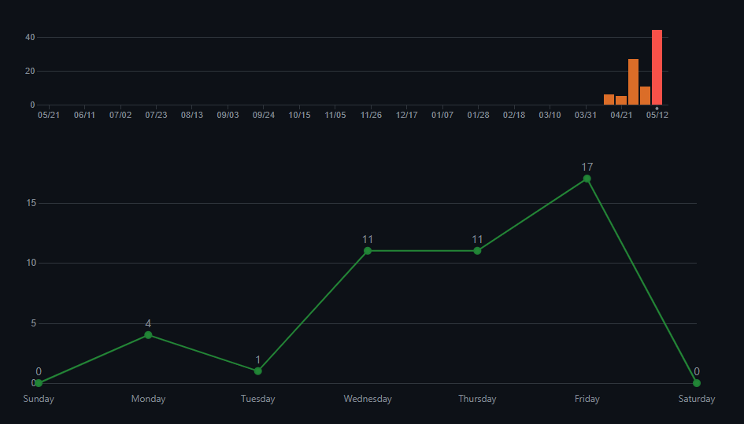
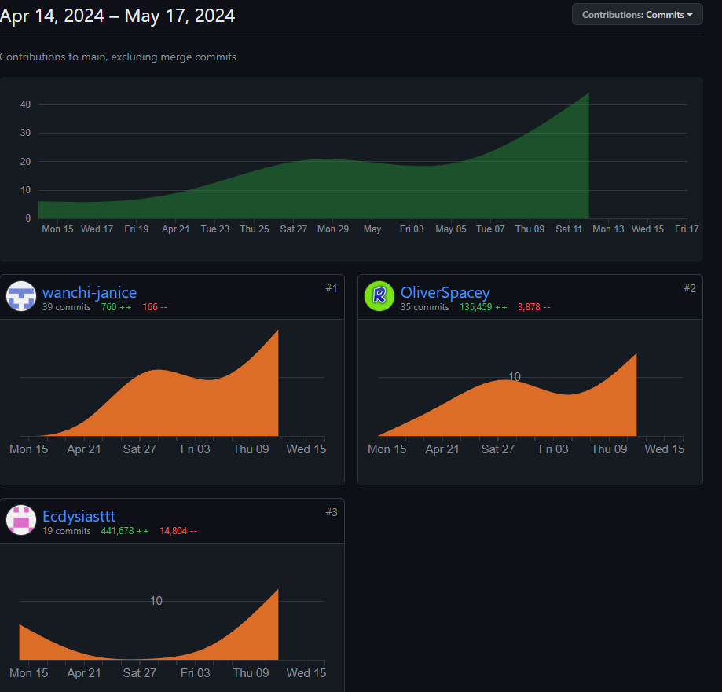
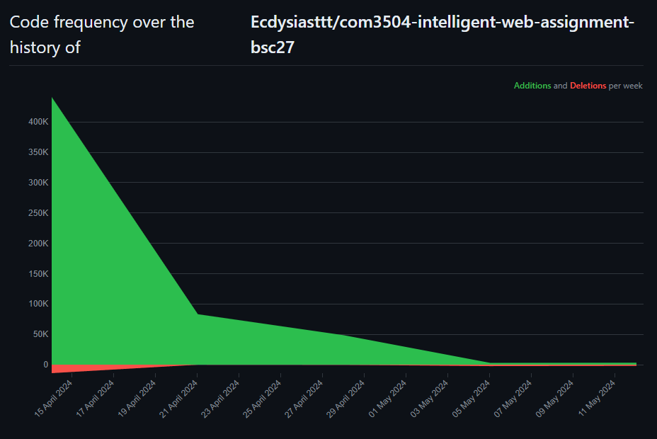

# <h1 align="center">PLANTPEDIA</h1> 

## COM3504 Assignment 
### May 2024
<p><b>Team Bc27</p></b>

## Brief Description of the Project:
<p>Welcome to PLANTPEDIA! This is a progressive web application for plant recognition. </p>
<br>Developed as a COM3504 Project, we aim to provide a convenient tool for users to record the details of the plants they have seen in an organised way, and also to look up details of plants more easily.</br>
<p>We also want to build up a community for plant lovers by allowing convenient interactions between plant viewers by chats and comments.</p>


### Authors:
<p><b>Oliver Spacey</p></b>
<p><b>Harry Scutt</p></b>
<p><b>Wan Chi Leung</p></b>


## Table of Contents

- [Installation](#installation)
- [Functionality](#functionality)
- [Credits](#credits)


## Installation:

Node.js version `20.0.0` or above recommended.

### Load Project

```bash
git clone git@github.com:Ecdysiasttt/com3504-intelligent-web-assignment-bsc27.git
```

### Move to Project

```bash
cd com3504-intelligent-web-assignment-bsc27
```

### Install Packages

```bash
npm install
```

### Run Project

First see what the route is to run the project.
```bash
npm run
```
It will be listed similar to:



In the case shown, the correct command to run the server would be:
```bash
npm run start
```

If this doesn't work and no scripts are shown in 'npm run', please contact us.

### Open Project

Enter the following address on your browser.

```bash
http://localhost:3000/
```

### Directory of Folders

- bins - entry point of the application
- controllers
- databases
- models
- node_modules
- public
- routes
- views

### Library and Packages

- Node.js v22.0.0
- socket.io v4.5.4
- Bootstrap v4.5.0
- Express.js

### Functionality:

- User 'login and logout' using username only
- Create plant details
- View all plant details
- Sort and categorise plants
- Comment on plants - online and offline
- Online storage in MongoDB database
- Caching 
- Offline storage in IndexedDB database
- Offline comments and plants sync to mongoDB when online
- PWA full support - installable to device

### Example of Use

Below are some examples of what should be displayed by the web app. Any deviation from these is not expected, and our contact details are provided below if there is any confusion.
All examples are given in Online mode for simplicity as this is main functionality. Offline may display slightly differently.

An example of the main page and how details are displayed:


Snippet of the details view:


Snippet of the add plant page:


## Design decisions:
- The user interface uses a simple layout and a white background so that the focus is on the photos of the plants.
- Users can select the locations of the plants on a map or use their geolocation to allow them add plant details after they leave the site.
- This web application uses MongoDB for online data storage for its flexibility in structured and unstructured data.
- This web application uses IndexedDB for offline data storage for its ability to store data persistently in the user's browser.
- As time quickly became limited, we opted to develop this web app using 'Agile' design philosophy - creating a minimum viable product fast, and then iterating over this with additional features. In this case, the MVP was a web app with online functionality, which was then iterated over to add offline compatibility. 


## Important notes:
- When the database is empty and a new plant is added, the web page will not load the filtering and sorting logic. To load this, clear the website's cache and reload.
- Plants that are created while offline cannot be viewed in the detailed mode until the website has cached their page. As such, you must return to online FIRST, and then you will be able to view details, add comments, view DBPedia etc.


## Credits:
<p>Oliver Spacey - ohmspacey1@sheffield.ac.uk</p>
<p>Harry Scutt - hasscutt1@sheffield.ac.uk</p>
<p>Wan Chi Leung - wcleung1@sheffield.ac.uk</p>

